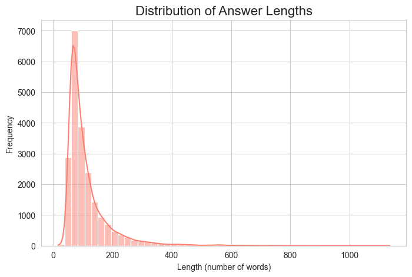
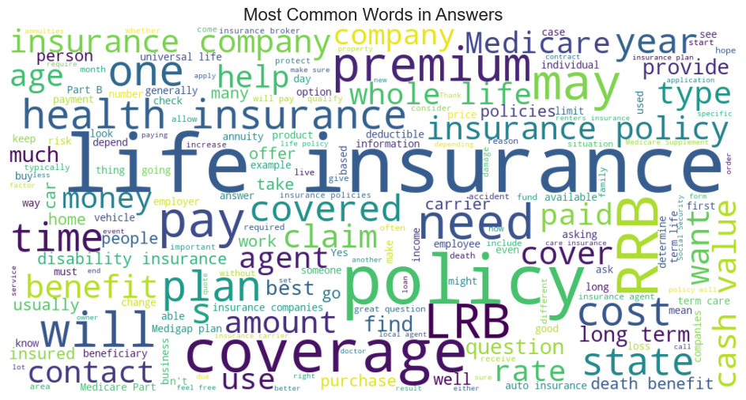

# InsuranceQA: A Domain-Specific Generative Chatbot


This repository contains the complete source code and documentation for a domain-specific chatbot fine-tuned to answer questions related to the insurance industry. The project demonstrates the end-to-end machine learning workflow, from initial data analysis and model experimentation to the deployment of an interactive web application.

## Table of Contents
- [1. Project Overview](#1-project-overview)
- [2. Features](#2-features)
- [3. Demo](#3-demo)
- [4. Technology Stack](#4-technology-stack)
- [5. Project Structure](#5-project-structure)
- [6. Getting Started](#6-getting-started)
  - [Prerequisites](#prerequisites)
  - [Installation and Setup](#installation-and-setup)
  - [Running the Application](#running-the-application)
- [7. Methodology](#7-methodology)
  - [7.1. Dataset Selection and Analysis](#71-dataset-selection-and-analysis)
  - [7.2. Model Architecture and Fine-Tuning Strategy](#72-model-architecture-and-fine-tuning-strategy)
- [8. Experiments and Results](#8-experiments-and-results)
  - [8.1. Ablation Study: The Search for Optimal Hyperparameters](#81-ablation-study-the-search-for-optimal-hyperparameters)
  - [8.2. Final Quantitative Evaluation](#82-final-quantitative-evaluation)
  - [8.3. Qualitative Analysis: A Tale of Two Models](#83-qualitative-analysis-a-tale-of-two-models)
- [9. Limitations and Future Work](#9-limitations-and-future-work)
- [10. Deployment](#10-deployment)
- [11. Acknowledgements](#11-acknowledgements)

## 1. Project Overview

The insurance industry is notoriously complex, with policy documents and terminology that are often opaque to the average consumer. This project aims to address this information gap by creating an accessible, on-demand conversational AI. By fine-tuning a pre-trained Transformer model on a specialized corpus of insurance-related questions and answers, we developed a chatbot capable of providing informative responses within its specific domain of knowledge. This `README` documents the journey, from the initial hypothesis to the final evaluation.

## 2. Features

* **Generative Question-Answering:** Leverages a fine-tuned T5 model to generate novel, free-text answers rather than selecting from a pre-defined list.
* **Domain-Specific Knowledge:** The model's expertise is exclusively focused on the U.S. insurance market, trained on a corpus of real-world user questions and expert answers.
* **Out-of-Domain (OOD) Rejection:** Implements a data-driven keyword filter, automatically generated from the training data's vocabulary, to politely refuse questions outside its scope of knowledge.
* **Interactive UI:** A clean, intuitive, and user-friendly web interface built with Streamlit for real-time interaction.


## 3. Demo

A live demonstration of the final application can be viewed in the project's summary video:
**[Link to Your Final Demo Video Here]**


## 4. Technology Stack

* **Backend & Modeling:** Python 3.11, TensorFlow 2.16.2
* **NLP Framework:** Hugging Face `transformers`, `datasets`, and `evaluate`
* **Data Manipulation:** Pandas, NLTK
* **Web Framework:** Streamlit
* **Project Management:** Makefile


## 5. Project Structure

The project is organized into a modular structure to enforce separation of concerns and improve maintainability.


```
.
├── app/
│   └── main.py                 # Streamlit application script
├── data/
│   ├── processed/              # Cleaned datasets and keyword file
│   └── raw/                    # Original downloaded dataset files
├── models/
│   ├── baseline_model/
│   └── lr_experiment_model/  # The final, best-performing model
├── notebooks/
│   └── 01_eda.ipynb           # Exploratory Data Analysis
├── src/
│   ├── chatbot.py              # Chatbot class with inference logic
│   ├── generate_keywords.py   # Script for OOD keyword generation
│   ├── model_setup.py         # Model and tokenizer loading
│   ├── run_evaluation.py      # Evaluation script (BLEU score)
│   └── train.py                # Model training script
├── Makefile                    # Commands for easy project management
├── requirements.txt            # Project dependencies
└── README.md                   # This file

```

## 6. Getting Started

Follow these instructions to set up the environment and run the project on your local machine.

### Prerequisites
* Python 3.11
* A virtual environment tool (e.g., `venv`)

### Installation and Setup
1.  **Clone the repository:**

    ```bash
        git clone https://github.com/Christianib003/kover
        cd kover
    ```

2.  **Create and activate a virtual environment:**
    ```bash
    python3 -m venv .env
    source .env/bin/activate
    ```

3.  **Install all dependencies using the Makefile:**
    This command conveniently installs all required libraries from the `requirements.txt` file.
    ```bash
    make setup
    ```
4.  **Generate the keyword file for OOD detection:**
    ```bash
    python src/generate_keywords.py
    ```

### Running the Application
The project uses a `Makefile` to simplify common tasks.

* **To run the Streamlit web application:**
    This will start the app using our best-performing model (`lr_experiment_model`). A URL will be provided in your terminal to view the app in your browser.
    ```bash
    make app
    ```

* **To re-run the model training experiments:**
    ```bash
    # Train the baseline model
    make train-baseline

    # Train the improved model (our champion)
    make train-lr-experiment
    ```

* **To evaluate the champion model on the test set:**
    This command calculates the final BLEU score on the unseen test data.
    ```bash
    make evaluate
    ```

## 7. Methodology

### 7.1. Dataset Selection and Analysis
The project is built upon the **InsuranceQA V2 dataset**, sourced from Hugging Face (`deccan-ai/insuranceQA-v2`). An Exploratory Data Analysis (EDA) was performed to validate its suitability. The analysis revealed that user questions are typically concise (mean 7.5 words), while the expert-written answers are comprehensive and detailed (mean 112 words). This asymmetry is ideal for training a model to generate informative responses from brief prompts.




A vocabulary analysis confirmed the dataset's high domain-relevance, with terms like **`insurance`**, **`policy`**, **`coverage`**, and **`claim`** being the most frequent.


### 7.2. Model Architecture and Fine-Tuning Strategy
The core of this project is a **T5-small** model, a 60-million parameter Transformer. Rather than training a model from scratch, which requires vast computational resources, we employed **fine-tuning**. This process adapts a large, general-purpose pre-trained model to our specific domain by continuing its training on our specialized dataset. T5's text-to-text framework is a natural fit for this task, as it is designed to transform an input text (a question) into a new output text (an answer).

## 8. Experiments and Results

### 8.1. Ablation Study: The Search for Optimal Hyperparameters
To achieve the best possible performance, a series of experiments were conducted to find the optimal hyperparameters. This ablation study allowed us to systematically measure the impact of each change.

| Experiment         | Learning Rate | Batch Size | Epochs | Scheduler | Final Validation Loss |
| ------------------ | ------------- | ---------- | ------ | --------- | --------------------- |
| **Baseline** | `2e-5`        | 8          | 3      | No        | `3.0566`              |
| **Champion Model** | `5e-5`        | 8          | 3      | No        | **`2.9243`** |
| **Final Experiment** | `5e-5`        | 16         | 5      | Yes       | `3.0101`              |

**Analysis:**
* The **Baseline** model, while showing signs of learning, performed poorly in qualitative tests.
* The **Champion Model**, with a higher learning rate of `5e-5`, achieved a significantly lower validation loss, indicating a more effective learning configuration.
* The **Final Experiment**, designed to further combat underfitting by training longer, unexpectedly resulted in a higher validation loss. This is a classic sign of the onset of **overfitting**, where the model begins to memorize the training data at the expense of its ability to generalize.

### 8.2. Final Quantitative Evaluation
The champion model (`lr_experiment_model`) was evaluated on the unseen test set to provide a final, unbiased measure of its text generation quality.
* **Final BLEU Score: 0.18.**

### 8.3. Qualitative Analysis: A Tale of Two Models
Direct interaction with the models confirmed the quantitative results. The improvement from the baseline to the champion model was clear.

> **Question:** "what does mortgage disability insurance cover?"
>
> **Baseline Model Response:**
> "Mortgage disability insurance covers a number of different types of disability insurance. Mortgage disability insurance covers a number of different types of disability insurance -LRB- e.g. disability insurance -RRB-..."
>
> **Champion Model Response:**
> "Mortgage disability insurance covers a number of things. If you have a mortgage, you may be able to get a mortgage. If you have a mortgage, you may be able to get a mortgage..."

The baseline model gets stuck in a severe repetitive loop on the keyword. The champion model, while still flawed and repetitive, attempts a more complex sentence structure, demonstrating a clear, albeit modest, improvement.

## 9. Limitations and Future Work

The final model, while representing a measurable improvement, is still **underfit** and not yet suitable for a production environment. Its answers can be repetitive, logically inconsistent, or lack the deep nuance required for sensitive financial topics. This is an expected outcome given the complexity of the domain versus the capacity of the `t5-small` model.

To improve performance, future work could include:
* **Extended Training:** The validation loss was still trending downward in the champion model. Training for a longer duration (e.g., 10-15 epochs) could yield further improvements.
* **Larger Model:** Migrating to a larger model like `t5-base` (220M parameters) would provide significantly more capacity to learn the complex patterns and vocabulary of the insurance domain.
* **Advanced OOD Detection:** While the keyword filter is effective, a more sophisticated approach using sentence embeddings could provide more nuanced out-of-domain detection.


## 10. Deployment

The application was prepared for deployment on **Hugging Face Spaces** using a `Dockerfile`. However, during startup, the combined memory requirements of the TensorFlow library and the T5 model consistently exceeded the basic RAM limit of the available free-tier hardware, preventing a successful launch. The model is fully functional when run in a local environment, as demonstrated in the project's demo video.

## 11. Acknowledgements

This project would not have been possible without the **InsuranceQA Corpus**, created by Feng et al. We thank the authors for making this valuable resource publicly available for research.

